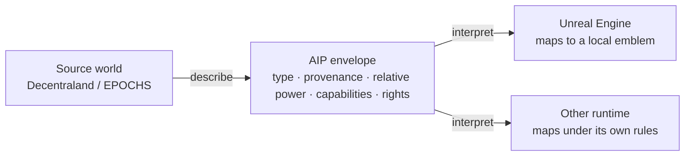

# Aeonic Interoperability Protocol (AIP)

An open semantic interoperability protocol for independent games and real-time 3D worlds.

A source world can describe an object, event, or identity. A destination world decides what that description means locally. Worlds do not share a database, engine, economy, or blockchain.

```text
Source World
object / event / identity
        ↓
AIP semantic envelope
meaning + provenance + relative context + capabilities
        ↓
Destination World
local interpretation
```

## Why this exists

Most “interoperability” copies files. Copying a GLB into another engine does not tell that engine whether the object is a weapon, a quest flag, a collectible, or a cosmetic.

AIP addresses a different problem: **portable meaning**.

- A powerful weapon in one RPG can arrive in another application as context, not as foreign damage numbers.
- The receiving game remains responsible for whether that object becomes a functional weapon, a balanced local equivalent, a cosmetic emblem, a collectible, or nothing.
- Participating worlds keep their own rendering, rules, security model, and data stores.

The architectural test is simple: **AIP should communicate meaning without requiring participating worlds to surrender control.**

## Public draft (0.1)

This repository is the public presentation of AIP. It is intentionally small. Internal design work continues separately.

| File | What it is |
| --- | --- |
| [`schemas/aip-envelope-0.1.schema.json`](schemas/aip-envelope-0.1.schema.json) | Draft envelope schema |
| [`examples/emberblade.aip.json`](examples/emberblade.aip.json) | Example object from an independent runtime |
| [`examples/unreal-local-mapping.json`](examples/unreal-local-mapping.json) | How Unreal might interpret that object |
| [`examples/decentraland-local-mapping.json`](examples/decentraland-local-mapping.json) | How Decentraland might interpret a foreign object |
| [`docs/architecture.md`](docs/architecture.md) | Destination sovereignty and engine-neutral adapters |
| [`explainer/index.html`](explainer/index.html) | 90-second visual walkthrough |

Open `explainer/index.html` in a browser and press **Record**. That page is meant to be screen-captured for grant reviewers and talks.

## Architecture



AIP does not require coordinate systems, gameplay stats, or item databases to become identical. It carries enough semantic context for each destination to decide.

Adapters are the funded, concrete work. The protocol stays engine-neutral:

```text
Decentraland / web / Three.js
        ↕
       AIP
        ↕
   Unreal Engine
```

Unreal is a reference implementation, not a requirement of AIP Core.

## Current status

**Prototype / in development.**

Existing AeonSmash work — interactive Decentraland worlds, cartridge/runtime systems, wearables, backend services, and asset tooling — is how the problem was found. This repository is the public protocol surface. A playable Unreal reference implementation is the next milestone.

AIP does **not** require:

- a shared game database
- a mandatory blockchain
- a common economy
- a single engine

## Roadmap

1. Freeze a tiny public envelope and examples *(this repo)*
2. Unreal Engine adapter / SDK and a small reference level
3. Bidirectional demonstration: Unreal ↔ AIP ↔ an independent runtime
4. Validation, diagnostics, and conformance fixtures
5. Documentation and sample integrations other developers can run

## License

MIT. See [LICENSE](LICENSE).

## Maintainer

[AeonSmash](https://github.com/AeonSmash) · [Decentraland Studios](https://studios.decentraland.org/profile/aeonsmash) · [aeonsmash.com](https://aeonsmash.com/)
